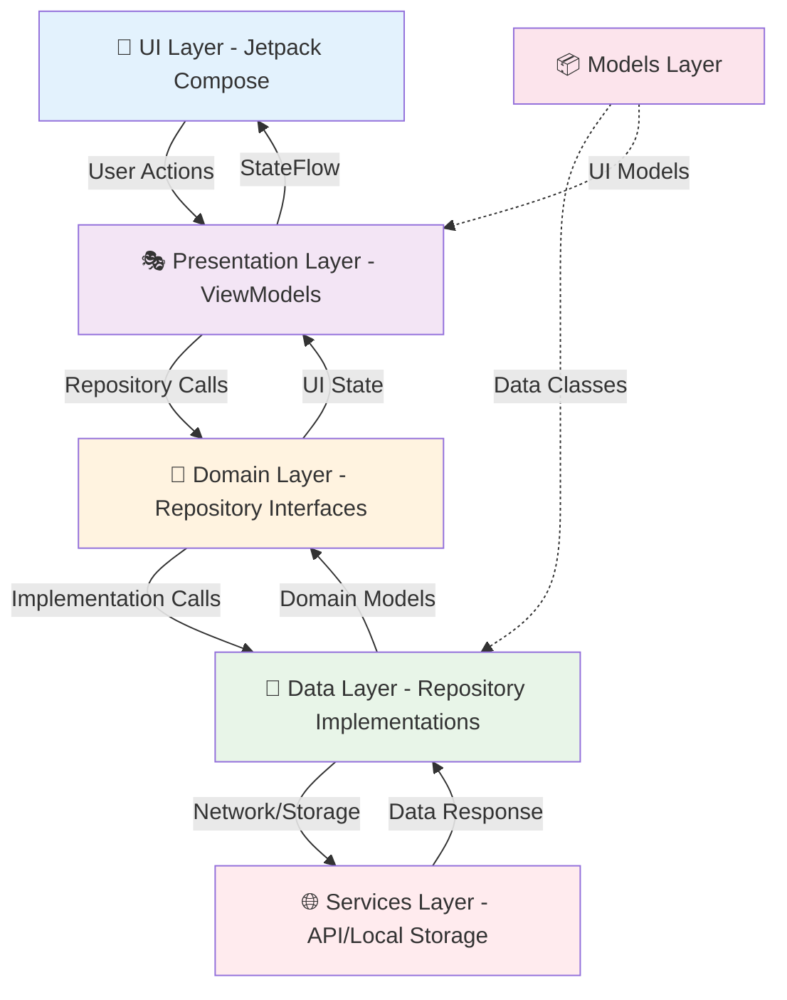

# 🔄 Pasabayan Android - Data Flow & State Management Architecture

## Overview: Unidirectional Data Flow

The Pasabayan Android app follows a **unidirectional data flow** pattern based on Clean Architecture principles, ensuring predictable state management and clear separation of concerns across all layers.

## 📋 Table of Contents
- [Visual Architecture Overview](#visual-architecture-overview)
- [Core Principles](#core-principles)
- [Architecture Layers](#architecture-layers)
- [Data Flow Patterns](#data-flow-patterns)
- [State Management Types](#state-management-types)
- [Real-World Examples](#real-world-examples)
- [Error Handling](#error-handling)
- [Performance Considerations](#performance-considerations)
- [Best Practices](#best-practices)

## Visual Architecture Overview



**Data Flow Direction:**
- **Actions UP**: UI → ViewModel → Repository → Service  
- **State DOWN**: Service → Repository → ViewModel → UI

## Core Principles

### 🔄 Unidirectional Flow
- **Actions flow UP**: User interactions travel from UI → ViewModel → Repository → Service
- **State flows DOWN**: Data travels from Service → Repository → ViewModel → UI
- **Single Source of Truth**: Each piece of state has one authoritative source
- **Reactive Updates**: UI automatically recomposes when state changes

### 🏗️ Architecture Benefits
1. **Predictable State Changes**: Always follow the same pattern
2. **Easy Debugging**: Clear data flow makes issues easier to trace
3. **Testability**: Each layer can be independently tested
4. **Maintainability**: Changes in one layer don't break others
5. **Scalability**: Easy to add new features without breaking existing code

## Architecture Layers

### 1. 📱 UI Layer (Compose Screens & Components)

**Responsibilities:**
- Display data to users
- Capture user interactions
- Handle local UI state (animations, form inputs, dialogs)
- Automatically recompose when observed state changes

**State Types:**
- `@Composable` state for UI-specific data
- `remember` and `mutableStateOf` for local state
- `collectAsState()` to observe ViewModel StateFlow

**Example Implementation:**
```kotlin
@Composable
fun ProfileScreen(
    authViewModel: AuthViewModel,
    roleViewModel: RoleViewModel
) {
    // Observe ViewModel state (State flows DOWN)
    val currentUser by authViewModel.currentUser.collectAsState()
    val currentRole by roleViewModel.currentRole.collectAsState()
    val isLoading by authViewModel.isLoading.collectAsState()
    
    // Local UI state (doesn't go through ViewModel)
    var showingEditDialog by remember { mutableStateOf(false) }
    
    LazyColumn(verticalArrangement = Arrangement.spacedBy(1.dp)) {
        item {
            // Profile Header Card
            PCardStandard {
                ProfileHeader(
                    user = currentUser,
                    role = currentRole,
                    onEditClick = { showingEditDialog = true } // Local state
                )
            }
        }
        
        item {
            // Role Switcher (Action flows UP)
            PCardStandard {
                RoleSwitcherView(
                    roleViewModel = roleViewModel,
                    onRoleChange = { newRole ->
                        roleViewModel.switchRole(newRole) // Action UP
                    }
                )
            }
        }
        
        // Role-specific menu items based on state
        if (currentRole == UserRole.CARRIER) {
            item {
                ProfileMenuItem(
                    icon = Icons.Default.DirectionsCar,
                    title = "Vehicle Information",
                    onClick = { /* Navigate */ } // Action UP
                )
            }
        }
    }
    
    // Loading overlay based on ViewModel state
    if (isLoading) {
        Box(modifier = Modifier.fillMaxSize()) {
            CircularProgressIndicator(modifier = Modifier.align(Alignment.Center))
        }
    }
}
```

### 2. 🧠 Presentation Layer (ViewModels)

**Responsibilities:**
- Manage UI-related state with StateFlow
- Handle user actions and coordinate business operations
- Transform domain data for UI consumption
- Manage loading states and error handling
- Survive configuration changes

**State Management Pattern:**
- Private `MutableStateFlow` for internal state changes
- Public `StateFlow` for UI observation
- `viewModelScope` for coroutine management

**Example Implementation:**
```kotlin
class AuthViewModel(
    private val authRepository: AuthRepository
) : ViewModel() {
    
    // Private mutable state
    private val _currentUser = MutableStateFlow<User?>(null)
    private val _isLoading = MutableStateFlow(false)
    private val _errorMessage = MutableStateFlow<String?>(null)
    
    // Public read-only state (flows DOWN to UI)
    val currentUser: StateFlow<User?> = _currentUser.asStateFlow()
    val isLoading: StateFlow<Boolean> = _isLoading.asStateFlow()
    val errorMessage: StateFlow<String?> = _errorMessage.asStateFlow()
    
    init {
        // Load initial state
        loadCurrentUser()
    }
    
    // Actions called from UI (flow UP)
    fun signInWithGoogle() {
        viewModelScope.launch {
            _isLoading.value = true
            _errorMessage.value = null
            
            try {
                val result = authRepository.signInWithGoogle()
                result.fold(
                    onSuccess = { user ->
                        _currentUser.value = user
                    },
                    onFailure = { error ->
                        _errorMessage.value = error.message
                    }
                )
            } catch (e: Exception) {
                _errorMessage.value = "Authentication failed: ${e.message}"
            } finally {
                _isLoading.value = false
            }
        }
    }
}
```

### 3. 🔧 Domain Layer (Repository Interfaces)

**Responsibilities:**
- Define contracts for data operations
- Establish business rules and validation
- Provide abstraction between presentation and data layers

**Example Implementation:**
```kotlin
interface AuthRepository {
    suspend fun signInWithGoogle(): Result<User>
    suspend fun signOut(): Result<Unit>
    suspend fun getCurrentUser(): User?
    suspend fun updateUserProfile(user: User): Result<User>
    fun observeAuthState(): Flow<User?>
}

interface PackageRepository {
    suspend fun createPackage(packageRequest: PackageRequest): Result<Package>
    suspend fun getPackages(userId: String): Result<List<Package>>
    suspend fun updatePackageStatus(packageId: String, status: PackageStatus): Result<Package>
    fun observePackages(userId: String): Flow<List<Package>>
}
```

### 4. 💾 Data Layer (Repository Implementations)

**Responsibilities:**
- Implement domain repository interfaces
- Coordinate between multiple data sources (API, local DB, cache)
- Handle data transformation between external and domain models
- Manage caching strategies and offline support

**Example Implementation:**
```kotlin
class AuthRepositoryImpl(
    private val authService: AuthService,
    private val userPreferences: UserPreferences
) : AuthRepository {
    
    override suspend fun signInWithGoogle(): Result<User> {
        return try {
            // Call external service
            val googleAccount = authService.signInWithGoogle()
            
            // Transform to domain model
            val user = googleAccount.toUser()
            
            // Cache locally for offline access
            userPreferences.saveUser(user)
            
            Result.success(user)
        } catch (e: Exception) {
            Result.failure(e)
        }
    }
    
    override suspend fun getCurrentUser(): User? {
        return try {
            // Try cache first
            userPreferences.getCurrentUser() 
                ?: authService.getCurrentUser()?.toUser()
        } catch (e: Exception) {
            null
        }
    }
}
```

### 5. 🌐 Services Layer (Data Sources)

**Responsibilities:**
- Handle actual API calls (Retrofit)
- Manage local storage (DataStore, Room)
- Handle authentication with external services (Firebase, Google)
- Transform raw data to data layer models

**Example Implementation:**
```kotlin
class AuthService(
    private val googleSignInClient: GoogleSignInClient,
    private val firebaseAuth: FirebaseAuth
) {
    suspend fun signInWithGoogle(): GoogleSignInAccount {
        return suspendCoroutine { continuation ->
            val signInIntent = googleSignInClient.signInIntent
            // Handle Google Sign-In flow
            // Return GoogleSignInAccount on success
        }
    }
    
    suspend fun getCurrentUser(): GoogleSignInAccount? {
        return GoogleSignIn.getLastSignedInAccount(context)
    }
}
```

### 6. 📊 Models Layer (Data Classes)

**Responsibilities:**
- Define data structures for different layers
- Handle data transformation between layers
- Implement validation logic
- Provide type safety

**Example Implementation:**
```kotlin
// Domain Models (used by ViewModels)
data class User(
    val id: String,
    val name: String,
    val email: String,
    val phone: String?,
    val avatar: String?,
    val roles: List<UserRole>,
    val verificationLevel: String,
    val createdAt: Instant
) {
    fun isVerified(): Boolean = verificationLevel != "unverified"
    fun hasRole(role: UserRole): Boolean = roles.contains(role)
}

// Extension functions for transformation
fun GoogleSignInAccount.toUser(): User {
    return User(
        id = this.id ?: "",
        name = this.displayName ?: "",
        email = this.email ?: "",
        phone = null,
        avatar = this.photoUrl?.toString(),
        roles = listOf(UserRole.SHIPPER), // Default role
        verificationLevel = "unverified",
        createdAt = Clock.System.now()
    )
}
```

## Real-World Data Flow Examples

### Example 1: Complete Authentication Flow

```
👤 User Action: Tap "Sign In with Google"
    ↓
📱 UI Layer: ProfileScreen.signInButton.onClick
    ↓
🧠 ViewModel: authViewModel.signInWithGoogle()
    ↓
🔧 Domain: authRepository.signInWithGoogle()
    ↓
💾 Data: authRepositoryImpl.signInWithGoogle()
    ↓
🌐 Service: authService.signInWithGoogle()
    ↓
🔐 External: Google Sign-In API
    ↓
📊 Model: GoogleSignInAccount → User (transformation)
    ↓
💾 Repository: Cache user, return Result<User>
    ↓
🧠 ViewModel: Update _currentUser StateFlow
    ↓
📱 UI: Automatic recomposition, show profile data
```

### Example 2: Role Switching with Cross-Screen Updates

```
👤 User Action: Toggle role switch (Carrier ↔ Shipper)
    ↓
📱 ProfileScreen: roleViewModel.switchRole(newRole)
    ↓
🧠 RoleViewModel: _currentRole.value = newRole
    ↓
📡 Broadcast: Role change emitted to all observers
    ↓
📱 DashboardScreen: Observes role change → recomposes with new content
📱 NavigationBar: Updates available tabs based on role
📱 AnalyticsScreen: Shows role-specific metrics
📱 MenuScreen: Shows role-specific menu items
```

### Example 3: Package Creation Flow

```
👤 User Action: Fill form and tap "Create Package"
    ↓
📱 CreatePackageScreen: packageViewModel.createPackage(formData)
    ↓
🧠 PackageViewModel: Validate form data
    ↓ (if valid)
🔧 Domain: packageRepository.createPackage(request)
    ↓
💾 Repository: Apply business rules, call service
    ↓
🌐 Service: POST /api/packages (Retrofit)
    ↓
🔗 Backend: Validate, save to database
    ↓
📊 Response: Return created Package with ID
    ↓
💾 Repository: Cache package locally
    ↓
🧠 ViewModel: Add to _packages StateFlow
    ↓
📱 UI: Show success message, update package list
```

## State Management Types

### 1. ViewModel State (Persistent)
**Used for:** Data that survives configuration changes and affects multiple UI components

```kotlin
class AuthViewModel : ViewModel() {
    // Survives rotation, shared across screens
    private val _currentUser = MutableStateFlow<User?>(null)
    val currentUser: StateFlow<User?> = _currentUser.asStateFlow()
}
```

### 2. Compose State (Local)
**Used for:** UI-specific state like form inputs, animations, dialog visibility

```kotlin
@Composable
fun LoginScreen() {
    // Lost on recomposition, local to this screen
    var email by remember { mutableStateOf("") }
    var password by remember { mutableStateOf("") }
    var showPassword by remember { mutableStateOf(false) }
}
```

### 3. Persistent State (Long-term)
**Used for:** User preferences, settings, cached data

```kotlin
class UserPreferences(private val dataStore: DataStore<Preferences>) {
    suspend fun saveUserRole(role: UserRole) {
        dataStore.edit { preferences ->
            preferences[USER_ROLE_KEY] = role.name
        }
    }
    
    fun observeUserRole(): Flow<UserRole> {
        return dataStore.data.map { preferences ->
            UserRole.valueOf(preferences[USER_ROLE_KEY] ?: UserRole.SHIPPER.name)
        }
    }
}
```

## Error Handling Strategies

### Unified Error State Pattern

```kotlin
sealed class UiState<out T> {
    object Loading : UiState<Nothing>()
    data class Success<T>(val data: T) : UiState<T>()
    data class Error(val exception: Throwable, val message: String) : UiState<Nothing>()
}

// ViewModel implementation
class PackageViewModel : ViewModel() {
    private val _packagesState = MutableStateFlow<UiState<List<Package>>>(UiState.Loading)
    val packagesState: StateFlow<UiState<List<Package>>> = _packagesState.asStateFlow()
    
    fun loadPackages() {
        viewModelScope.launch {
            _packagesState.value = UiState.Loading
            try {
                val packages = packageRepository.getPackages()
                _packagesState.value = UiState.Success(packages)
            } catch (e: Exception) {
                _packagesState.value = UiState.Error(e, "Failed to load packages")
            }
        }
    }
}

// UI implementation
@Composable
fun PackagesScreen(viewModel: PackageViewModel) {
    val state by viewModel.packagesState.collectAsState()
    
    when (state) {
        is UiState.Loading -> CircularProgressIndicator()
        is UiState.Success -> PackageList(packages = state.data)
        is UiState.Error -> ErrorScreen(
            message = state.message,
            onRetry = { viewModel.loadPackages() }
        )
    }
}
```

## Performance Considerations

### 1. State Flow Optimization

```kotlin
class CarrierViewModel : ViewModel() {
    // Use stateIn to convert Flow to StateFlow with sharing
    val earnings = earningsRepository
        .observeEarnings(carrierId)
        .stateIn(
            scope = viewModelScope,
            started = SharingStarted.WhileSubscribed(5000), // Stop after 5s of no subscribers
            initialValue = EarningsData.empty()
        )
}
```

### 2. Compose Performance

```kotlin
@Composable
fun PackagesList(
    packages: List<Package>,
    onPackageClick: (Package) -> Unit
) {
    LazyColumn {
        items(
            items = packages,
            key = { package -> package.id } // Stable keys for optimization
        ) { package ->
            PackageCard(
                package = package,
                onClick = remember { { onPackageClick(package) } }
            )
        }
    }
}
```

## Best Practices Summary

### ✅ Do
1. **Always use StateFlow for ViewModel state** that outlives configuration changes
2. **Use remember for local UI state** that doesn't need to survive recomposition
3. **Implement proper error handling** at each layer
4. **Cache data appropriately** to improve performance
5. **Use stable keys** in LazyColumn/LazyRow for better performance
6. **Follow unidirectional data flow** - actions up, state down
7. **Keep ViewModels focused** on UI state management
8. **Use Result type** for operations that can fail
9. **Write tests** for each layer independently

### ❌ Don't
1. **Don't put business logic in Composables** - keep them pure and focused on UI
2. **Don't directly call repositories from UI** - always go through ViewModels
3. **Don't ignore error states** - always handle loading, success, and error
4. **Don't block the main thread** - use proper coroutines for async operations
5. **Don't leak ViewModels** - let Compose handle their lifecycle
6. **Don't share mutable state** between different parts of the app
7. **Don't forget to handle configuration changes** properly

## Summary

This architecture ensures that the Pasabayan Android app maintains consistent, predictable data flow while providing excellent user experience through reactive UI updates and proper error handling. The unidirectional flow pattern makes the app easier to debug, test, and maintain while supporting scalable feature development. 