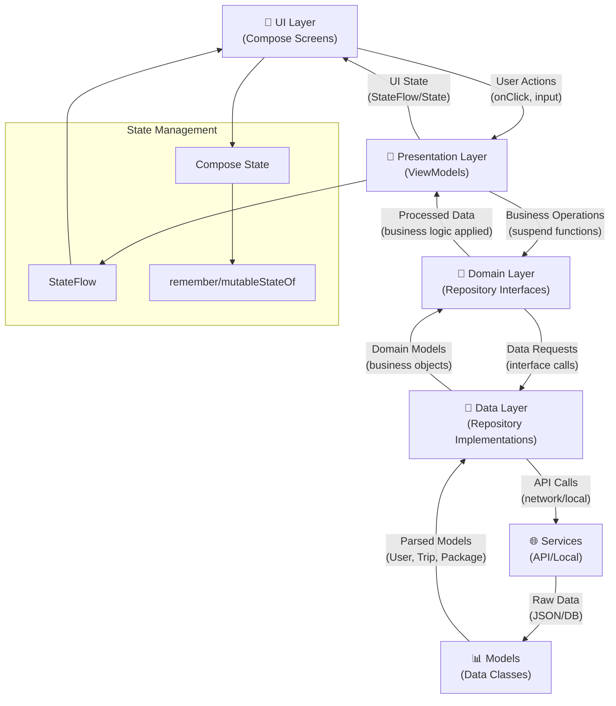
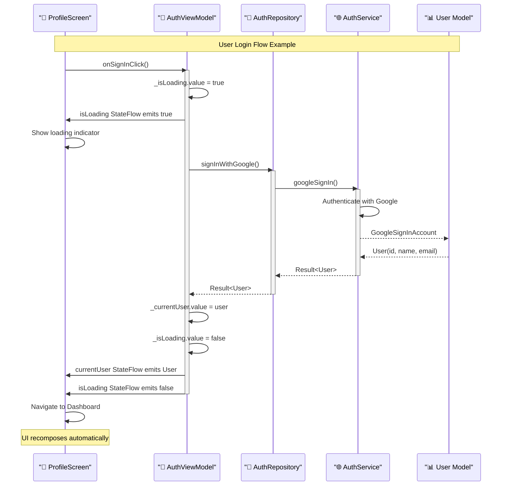
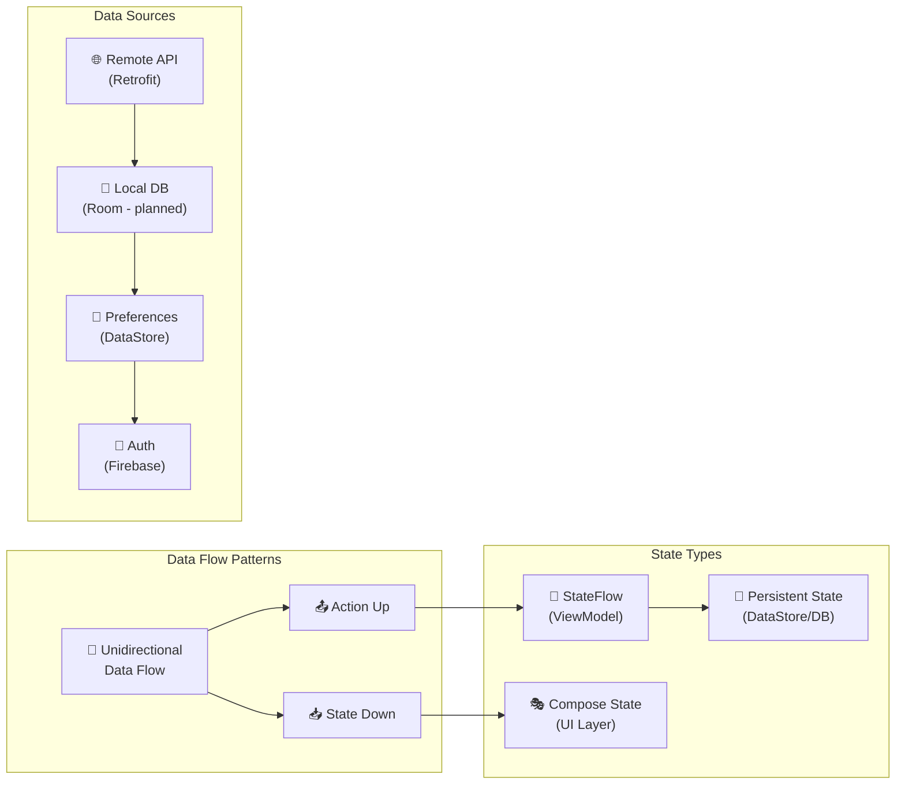
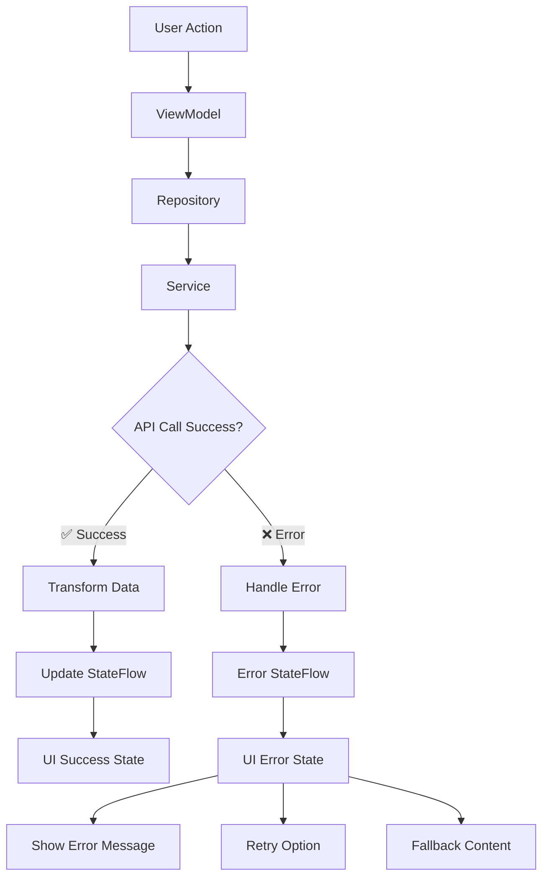
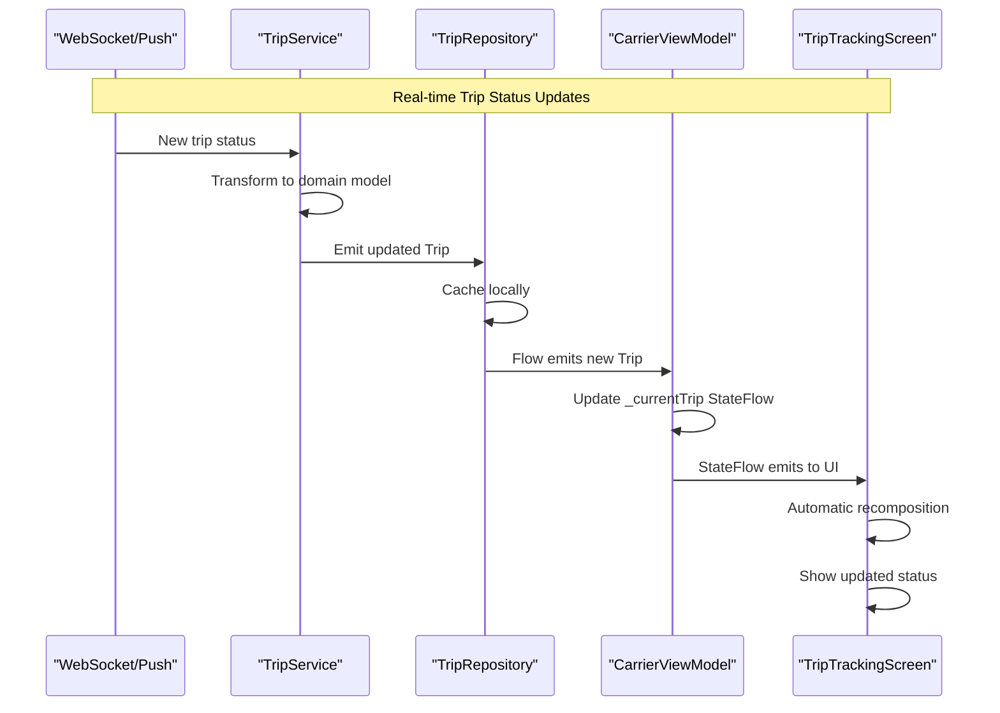
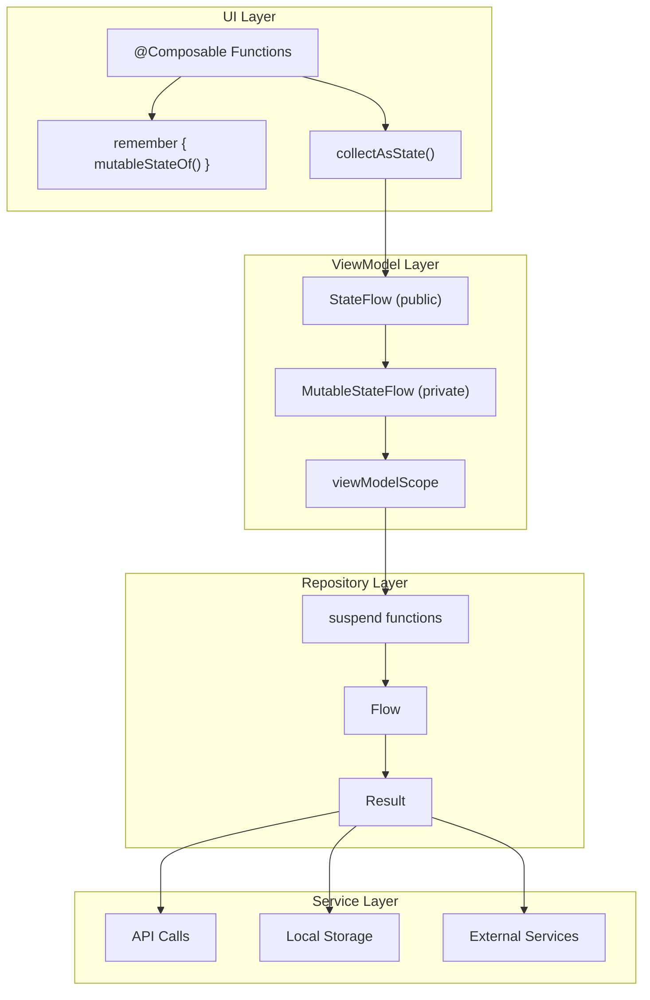

# 📊 Pasabayan Android - Visual Architecture Diagrams

This file contains all the visual diagrams for the Pasabayan Android app's data flow and state management architecture. These diagrams are created using Mermaid and will render as images on platforms that support Mermaid (GitHub, GitLab, etc.).

## 📋 Table of Contents
- [Overall Architecture Flow](#overall-architecture-flow)
- [User Authentication Sequence](#user-authentication-sequence)
- [Data Flow Patterns](#data-flow-patterns)
- [Component Interaction Flow](#component-interaction-flow)
- [Error Handling Flow](#error-handling-flow)

---

## Overall Architecture Flow

This diagram shows the complete data flow between all layers of the Clean Architecture pattern:

**Key Points:**
- **Actions flow UP**: User interactions travel upward through the layers
- **State flows DOWN**: Data and state updates flow downward to the UI
- **StateFlow**: Used for cross-layer communication and persistent state
- **Compose State**: Used for local UI state that doesn't need persistence

---

## User Authentication Sequence

This sequence diagram shows a complete user authentication flow from UI interaction to state update:

**Key Points:**
- **Reactive UI**: Loading states automatically trigger UI updates
- **Error Handling**: Each layer can handle and transform errors appropriately
- **State Synchronization**: Multiple StateFlows can be updated simultaneously
- **Automatic Recomposition**: Compose UI automatically updates when state changes

---

## Data Flow Patterns

This diagram illustrates the different data flow patterns and state types used throughout the app:

**Key Points:**
- **Unidirectional Flow**: Ensures predictable state changes
- **StateFlow**: For cross-component communication and configuration-change survival
- **Compose State**: For local UI state that doesn't need persistence
- **Multiple Data Sources**: API, local database, preferences, and authentication

---

## Component Interaction Flow

This diagram shows how different components interact in real-world scenarios:

```mermaid
graph TD
    subgraph "Profile Screen Flow"
        A["User taps ProfileMenuItem"]
        B["ProfileScreen captures onClick"]
        C["Navigate to specific screen"]
    end
    
    subgraph "Role Switching Flow"
        D["User toggles RoleSwitcher"]
        E["RoleViewModel.switchRole()"]
        F["Update _currentRole StateFlow"]
        G["All observing screens recompose"]
    end
    
    subgraph "Package Creation Flow"
        H["User fills form"]
        I["PackageViewModel.createPackage()"]
        J["Repository validates & saves"]
        K["Update _packages StateFlow"]
        L["UI shows success & updates list"]
    end
    
    A --> B
    B --> C
    
    D --> E
    E --> F
    F --> G
    
    H --> I
    I --> J
    J --> K
    K --> L
```

**Key Points:**
- **User Actions**: Always start from UI components
- **Cross-Screen Updates**: Role changes affect multiple screens simultaneously
- **Form Handling**: Validation and processing happens in ViewModels
- **Real-time Updates**: External data changes automatically update relevant screens

---

## Error Handling Flow

---

## Real-time Data Synchronization

---

## State Management Layers

---

## Notes for Developers

### Viewing These Diagrams
- **GitHub/GitLab**: These Mermaid diagrams will automatically render as images
- **Local Development**: Use Mermaid Live Editor (https://mermaid.live) to view
- **IDE Support**: Many IDEs have Mermaid preview plugins

### Integration with Documentation
These diagrams complement:
- `DATA_FLOW_ARCHITECTURE.md` - Detailed explanation
- `README.md` - High-level overview
- Actual source code - The ground truth

---

*These diagrams represent the current state of the Pasabayan Android app architecture* 