# Visual Diagrams - Pasabayan Android App

**Mermaid Diagrams for Data Flow and Architecture Visualization**

This document contains interactive diagrams that automatically render on GitHub, GitLab, and other platforms supporting Mermaid syntax.

## 📋 Table of Contents

1. [Overall Architecture Flow](#overall-architecture-flow)
2. [Authentication Sequence Diagrams](#authentication-sequence-diagrams)
3. [Data Flow Patterns](#data-flow-patterns)
4. [Component Interaction Flows](#component-interaction-flows)
5. [Error Handling Flow](#error-handling-flow)
6. [Real-time Data Synchronization](#real-time-data-synchronization)
7. [State Management Layers](#state-management-layers)

---

## 📊 Overall Architecture Flow

### Clean Architecture + MVVM Data Flow

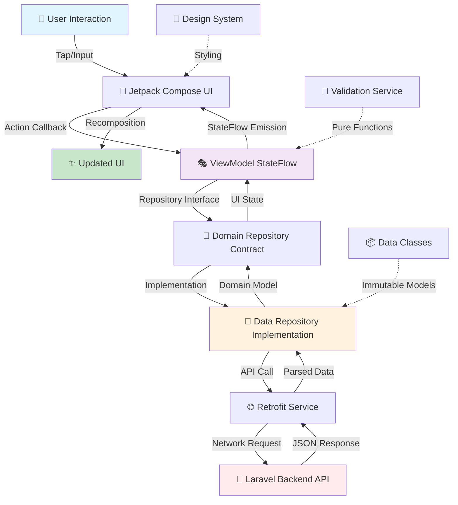

### StateFlow Management Architecture

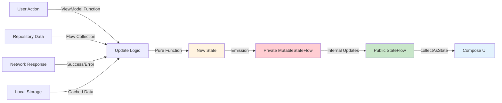

---

## 🔐 Authentication Sequence Diagrams

### Google Sign-In Flow

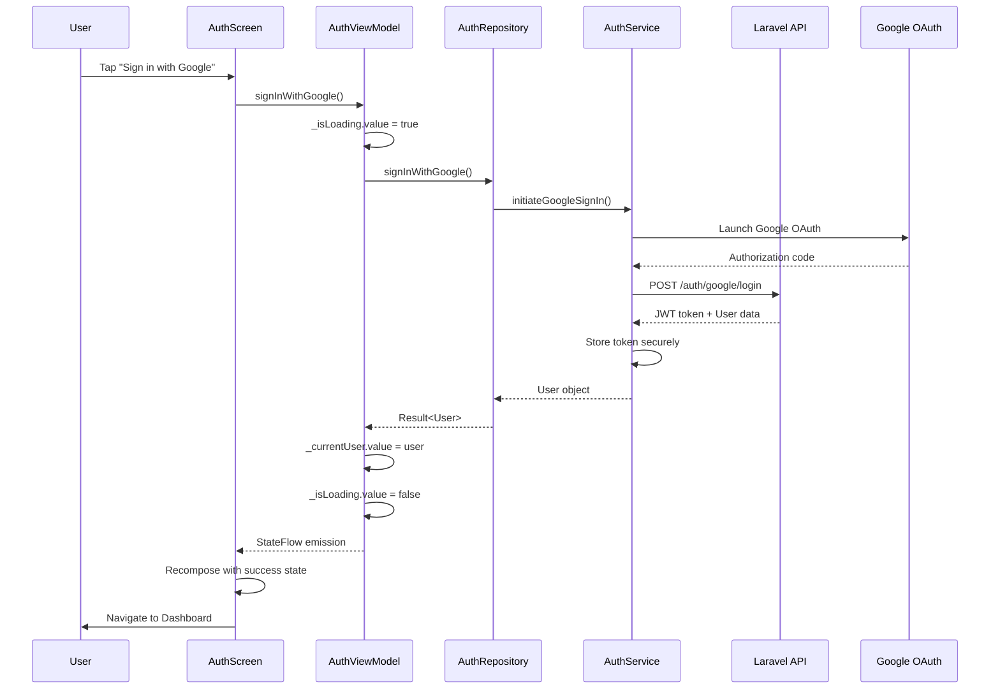

### Phone Verification Flow

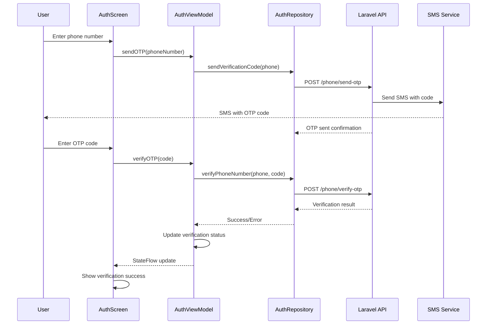

---

## 🔄 Data Flow Patterns

### Unidirectional Data Flow

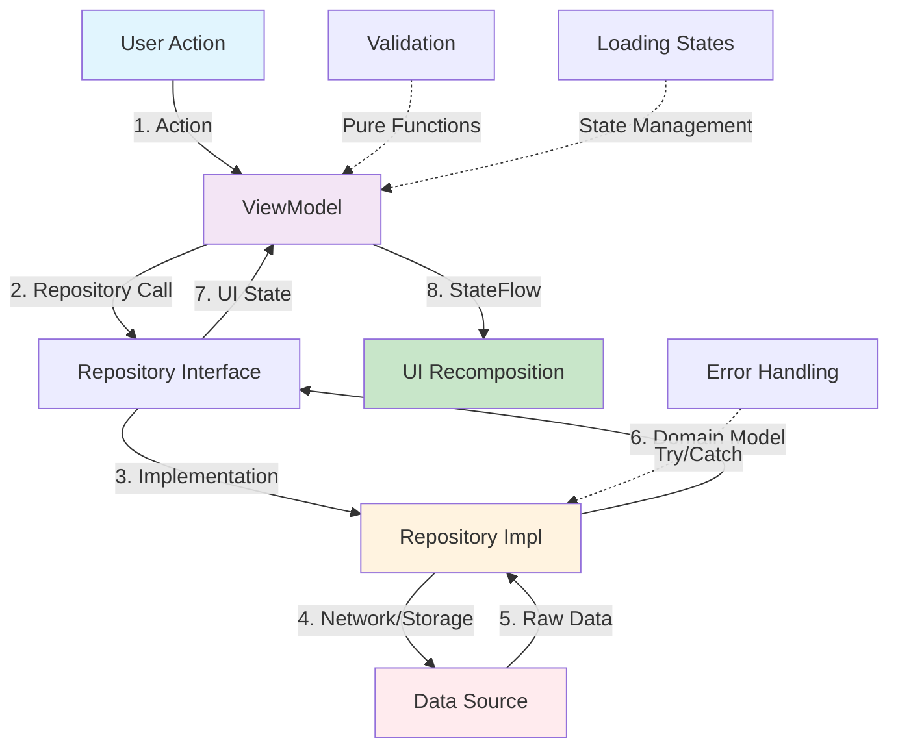

### State Types and Lifecycle

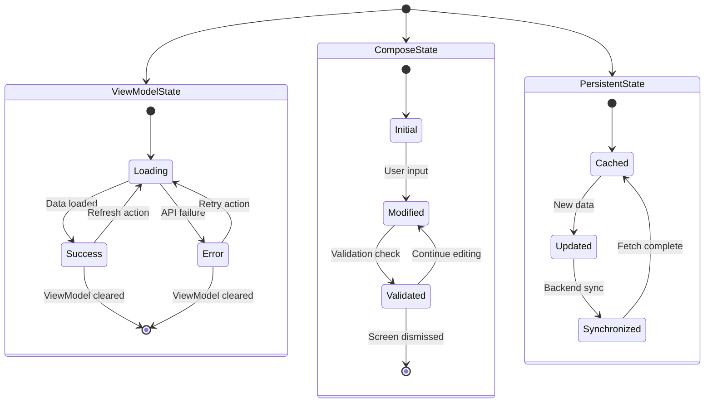

---

## 🔗 Component Interaction Flows

### Profile Screen Role Switching

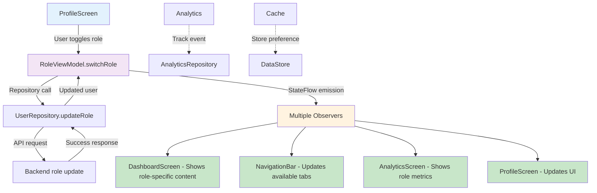

### Trip Creation Flow

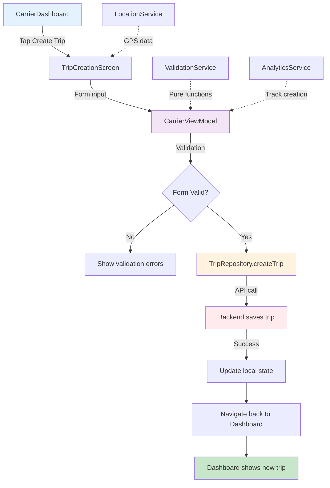

### Package Request and Booking

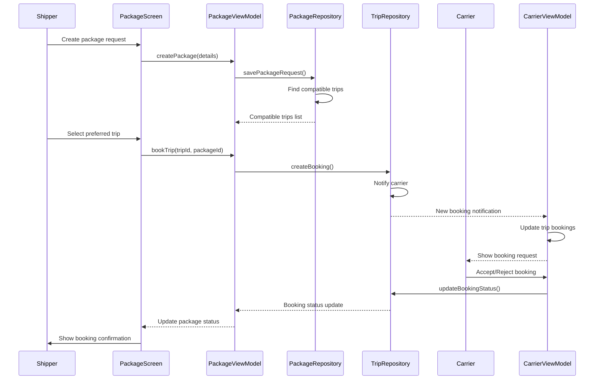

---

## ⚠️ Error Handling Flow

### Unified Error State Pattern

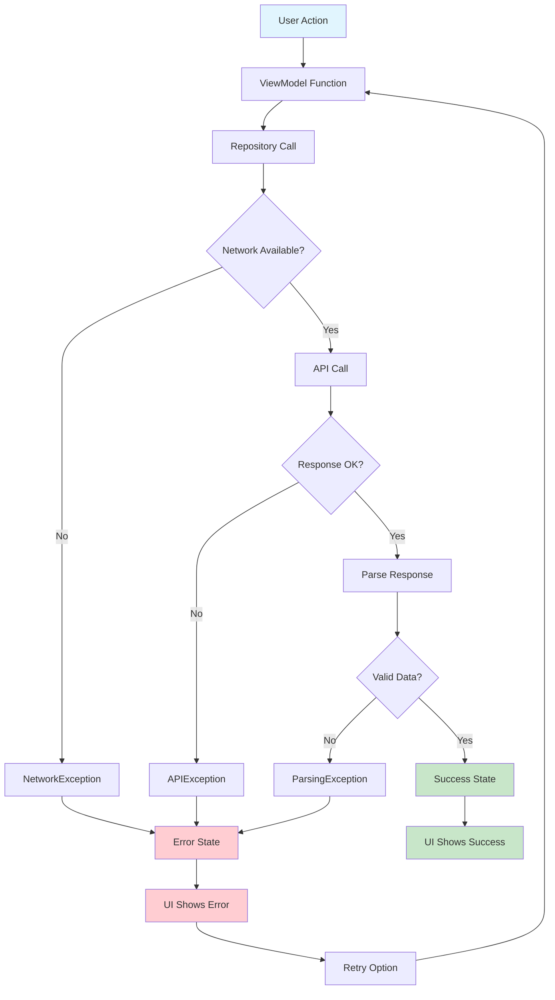

### Error Recovery Strategies

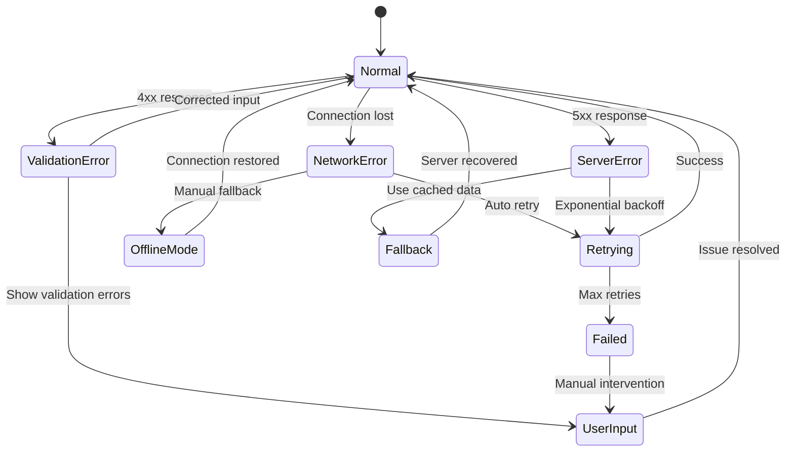

---

## 📡 Real-time Data Synchronization

### WebSocket Data Flow

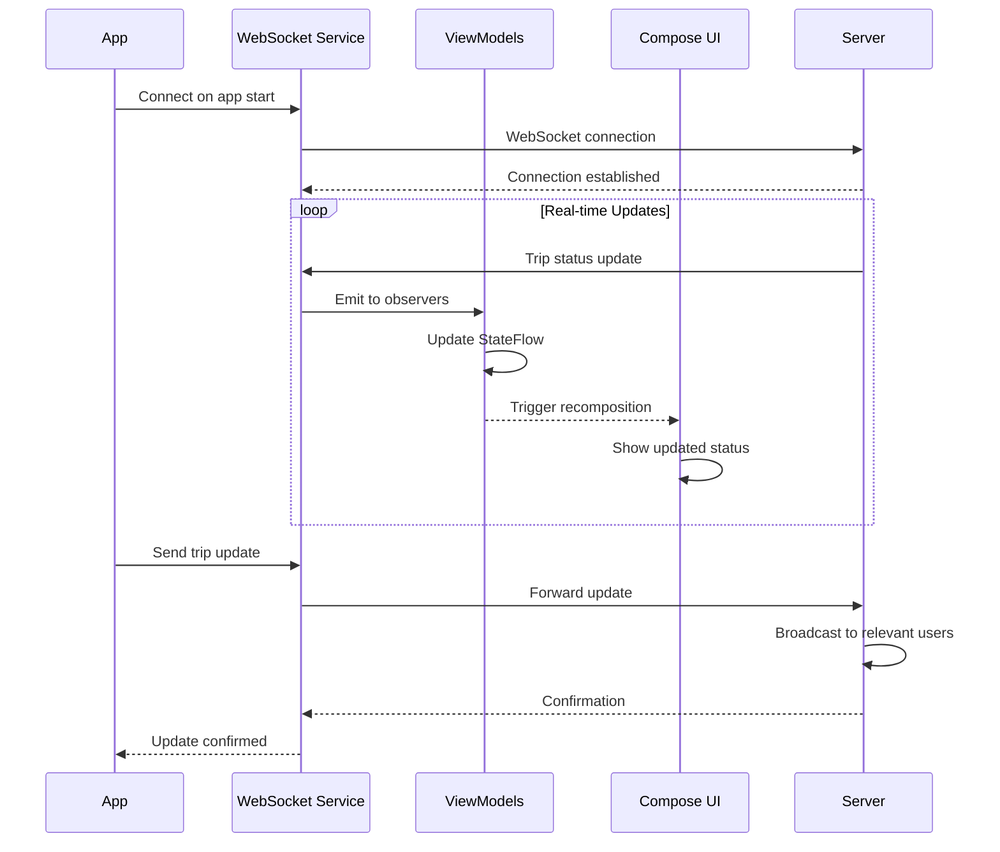

### Push Notification Flow

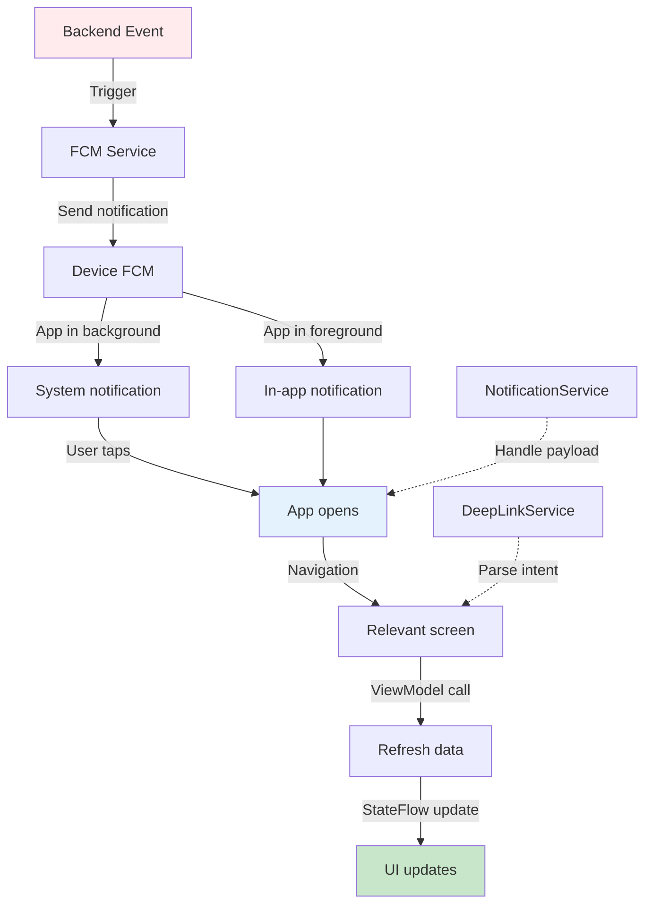

---

## 🏗️ State Management Layers

### Multi-Layer State Architecture

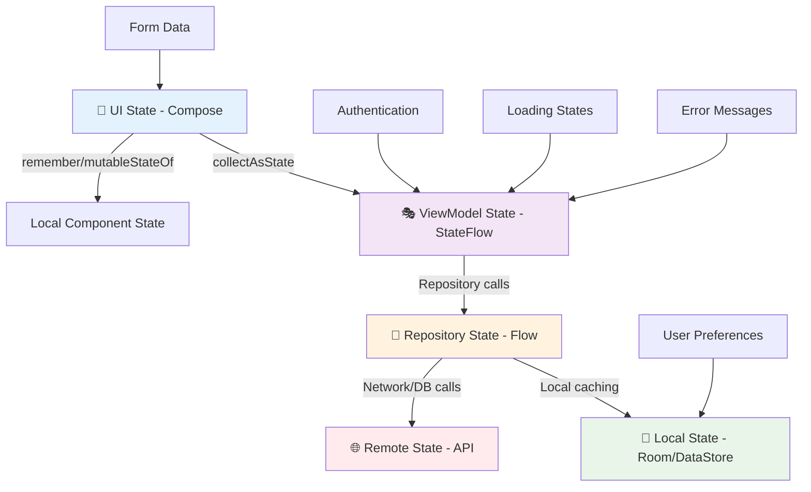

### State Lifecycle Management

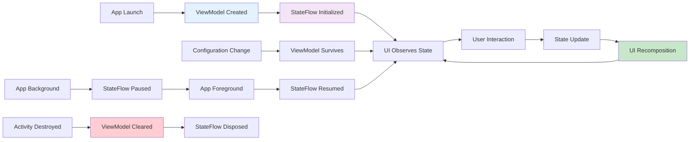

### Performance Optimization Flow

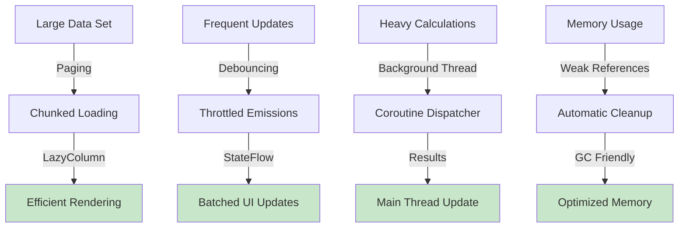

---

## 📱 Implementation Examples

### StateFlow with Compose Integration

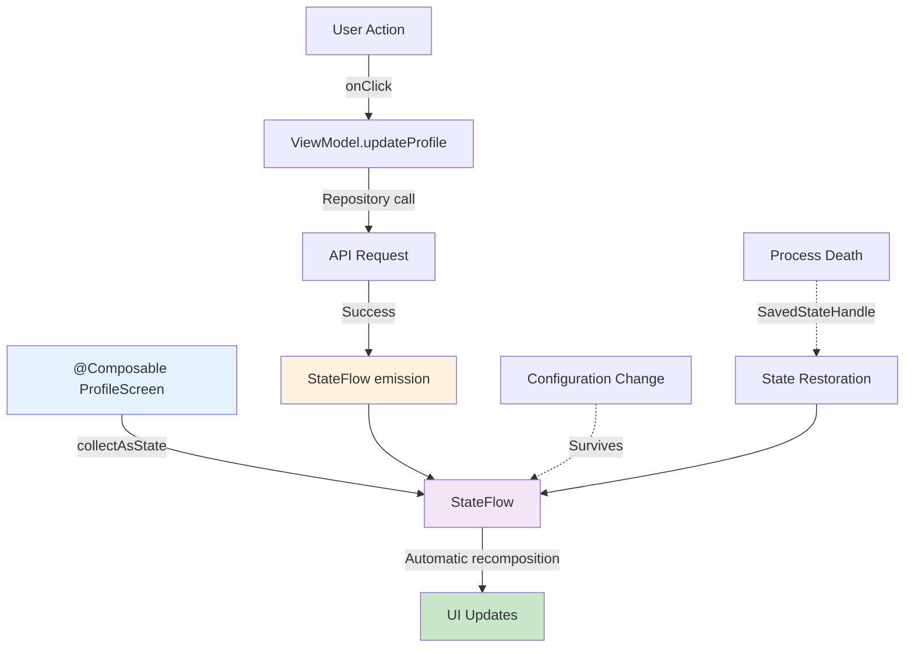

---

**Pasabayan Android** - *Visual Architecture Documentation* 🚛📱✨

> These diagrams automatically render on GitHub, GitLab, and other platforms supporting Mermaid syntax, providing interactive visualization of our app's architecture and data flow patterns. 